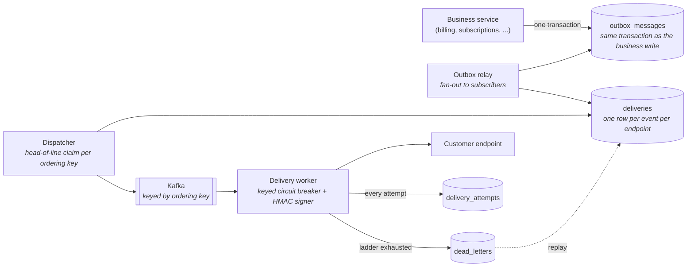

# HookRelay

Outbound webhook delivery for .NET: signed, ordered, retried, dead-lettered, and replayable.

[](https://github.com/tunahanaliozturk/hookrelay/actions/workflows/ci.yml)
[](LICENSE)
[](global.json)

Every product eventually has to push events to URLs its customers control. The version that gets written
first is a `PostAsync` in a `try`/`catch`, and it fails in every direction at once: one slow customer
endpoint stalls delivery for everyone, a retry loop hammers a service that is already struggling, a
transient failure drops an event with no record it existed, and two related events arrive in the wrong
order and corrupt whatever state machine the customer built on top of them.

This is the other version. It makes four promises and each one has a test that would fail if it stopped
being true.

## What it guarantees

| Promise | How it is enforced | Where it is proven |
| --- | --- | --- |
| No event is lost between the business write and the queue | Transactional outbox: the event row commits with the business change or not at all | [`OutboxDurabilityTests`](tests/HookRelay.IntegrationTests/OutboxDurabilityTests.cs) |
| Every event is eventually delivered, at least once | Persisted backoff ladder, seven attempts over 31 hours, then a dead letter that can be replayed | [`EndToEndChaosTests`](tests/HookRelay.IntegrationTests/EndToEndChaosTests.cs) |
| Events arrive in the order they were produced, per ordering key | The dispatcher will not claim a delivery while an older one with the same key is unresolved | [`OrderingTests`](tests/HookRelay.IntegrationTests/OrderingTests.cs) |
| One customer's dead endpoint does not affect anyone else | One circuit breaker per endpoint, never a shared pipeline | [`CircuitBreakerIsolationTests`](tests/HookRelay.IntegrationTests/CircuitBreakerIsolationTests.cs) |

The tests run against real Postgres and real Kafka in containers, and against a receiver that fails 30% of
requests on purpose. A retry and circuit-breaker implementation that has only ever been exercised against a
stub returning `200` has not been tested against the thing it exists for.

## Quick start

```bash
docker compose up --build
```

That brings up Postgres, Kafka, the API, the outbox relay, two delivery workers, and a receiver configured
to fail about a third of the time. Then, in another terminal:

```bash
TENANT=$(uuidgen)

# Register a destination. The signing secret is returned exactly once, here and nowhere else.
curl -s localhost:5000/v1/endpoints \
  -H "Content-Type: application/json" \
  -H "X-Tenant-Id: $TENANT" \
  -d '{
        "url": "http://chaos-receiver:8080/hooks/demo",
        "description": "Demo receiver",
        "eventTypes": ["invoice.*"]
      }' | tee /tmp/endpoint.json

ENDPOINT=$(jq -r .endpoint.id /tmp/endpoint.json)

# Publish a few events, the way a billing service would.
for i in $(seq 1 20); do
  curl -s localhost:5000/v1/events \
    -H "Content-Type: application/json" \
    -H "X-Tenant-Id: $TENANT" \
    -d "{\"eventType\":\"invoice.paid\",\"aggregateId\":\"inv_$i\",\"payload\":{\"amount\":4200,\"n\":$i}}" \
    > /dev/null
done

# Watch them go out, fail, back off, and land.
curl -s "localhost:5000/v1/endpoints/$ENDPOINT/deliveries" -H "X-Tenant-Id: $TENANT" | jq
```

Pick any delivery id from that list and read its full attempt history:

```bash
curl -s "localhost:5000/v1/deliveries/$DELIVERY_ID" -H "X-Tenant-Id: $TENANT" | jq
```

You will see the failed attempts, each with its status code and latency, the timestamp the next attempt was
scheduled for, and the one that finally succeeded.

### Running it with Aspire instead

```bash
dotnet run --project src/HookRelay.AppHost
```

Same stack, plus the Aspire dashboard with traces and metrics for every service. This is the better way to
watch a circuit breaker open and close.

## How it works



Four moving parts, each doing one thing:

**The outbox** is where durability starts. A producer calls `IWebhookEventPublisher.Publish` inside the
transaction it already has open. If the business write commits, the event exists. If it rolls back, the
event never existed. There is no window where a customer was charged but the event announcing it was lost,
which is exactly the window a publish-after-commit call leaves open.

**The relay** turns one outbox row into one delivery per subscribed endpoint. From that point each delivery
has its own attempt count, its own place on the backoff ladder, and its own pinned secret version.

**The dispatcher** decides what is due and hands it to the workers. This is where ordering is enforced: it
will not claim a delivery while an older one with the same ordering key is still pending or in flight.

**The worker** signs the payload, makes one bounded HTTP call through that endpoint's own circuit breaker,
and records what happened before moving on.

### Ordering is not Kafka's job here

The obvious design keys the queue by destination and lets partition ordering do the work. That holds until
the first retry. A failed delivery comes back 30 seconds later, then 2 minutes, then an hour, and by then
the events behind it in the partition have long since been consumed and delivered. Partition ordering gives
the right answer for the first attempt and the wrong one from then on.

So the guarantee lives in the claim query instead:

```sql
AND NOT EXISTS (
    SELECT 1 FROM deliveries AS earlier
    WHERE earlier.ordering_key = d.ordering_key
      AND earlier.status IN (0, 1)
      AND earlier.sequence < d.sequence)
```

Position comes from a database sequence, not from the id. UUIDv7 was the obvious choice and it is wrong
here: it only orders down to the millisecond, and a fan-out pass creates every delivery with the same
timestamp, so within one batch the ids sort by their random tail. That bug was live until the ordering
tests caught it.

Kafka is still keyed by the ordering key, but for worker affinity rather than correctness. Full reasoning
in [ADR 2](docs/adr/0002-ordering-is-a-database-claim-not-a-kafka-partition.md).

A useful consequence: workers can process signals with bounded concurrency instead of one partition at a
time, because no two in-flight signals can belong to the same ordered stream. Throughput is not capped by
partition count.

### Ordering is scoped, and the scope is a choice

| Strategy | Ordered stream | Trade-off |
| --- | --- | --- |
| `PerEndpoint` | Everything for one destination | Strongest guarantee. A stuck delivery holds back every later event for that endpoint |
| `PerEndpointAndAggregate` | One entity at a time, per destination | A stuck invoice does not hold up an unrelated subscription |

The guarantee is never claimed globally, and never across destinations.

### Retries are stored, not held in memory

A Polly retry strategy holds its delay in memory. Waiting out a 24 hour rung that way means one process
staying up for a day, and a deploy loses every retry in flight. So the ladder is persisted: a failed
delivery writes `next_attempt_at_utc` and the dispatcher polls for what is due.

| Attempt | Delay before it |
| --- | --- |
| 2 | 30 seconds |
| 3 | 2 minutes |
| 4 | 10 minutes |
| 5 | 1 hour |
| 6 | 6 hours |
| 7 | 24 hours |

Polly is still there, doing the thing it is good at: one circuit breaker per endpoint, from a
`ResiliencePipelineRegistry<Guid>`. When a circuit is open the worker records the attempt with outcome
`CircuitOpen` and sends nothing, so a struggling endpoint gets a rest instead of a harder hammering, and a
support engineer can see in the log that the fleet deliberately did not call. See
[ADR 4](docs/adr/0004-backoff-is-persisted-polly-handles-the-call.md).

The schedule is configuration, which is also how CI runs the whole cycle including exhaustion in seconds.

### Security

A webhook sender is a request forwarder that anyone with an account can aim wherever they like. That makes
server-side request forgery the defining vulnerability of this kind of service rather than an edge case, so
it is closed in three places:

- Registration refuses non-https URLs, embedded credentials, and literal addresses in private, loopback,
  link-local, or carrier-grade NAT ranges.
- The HTTP client refuses redirects. A 302 is otherwise a free way to turn an allowed request into one that
  never would have passed the check.
- The connect callback resolves DNS and re-checks the actual address before opening the socket, which is
  what closes the rebinding gap that a registration-time check leaves open.

`169.254.169.254` returns instance credentials on every major cloud, and a sender that will POST to it and
show the response body in a delivery log is a credential exfiltration endpoint. That case has [its own
test](tests/HookRelay.UnitTests/WebhookUrlPolicyTests.cs).

Signatures are HMAC-SHA256 over `"{timestamp}.{raw body}"`, the construction Stripe publishes, with a
timestamp window that bounds how long a captured payload stays replayable. The comparison is constant time.
Signing secrets are encrypted with AES-256-GCM rather than hashed, because a sender has to reproduce the
secret to sign with it; the reasoning and its blast radius are in
[ADR 3](docs/adr/0003-signing-secrets-are-encrypted-not-hashed.md). The plaintext is returned exactly once,
by the call that mints it.

Receiver-side verification, in C#, Node, and Python: [docs/verifying-signatures.md](docs/verifying-signatures.md).

## API

Every request carries `X-Tenant-Id`. Authentication belongs to the platform this service sits inside, so
the tenant arrives in a header and everything downstream filters on it. Swapping that for a claim on a
verified token is a one-method change in [`RequestContext`](src/HookRelay.Api/RequestContext.cs).

| Method | Route | What it does |
| --- | --- | --- |
| `POST` | `/v1/endpoints` | Register a destination. Returns the signing secret, once |
| `GET` | `/v1/endpoints` | List destinations for the tenant |
| `GET` | `/v1/endpoints/{id}` | Read one destination |
| `PUT` | `/v1/endpoints/{id}/subscriptions` | Replace the subscribed event types |
| `POST` | `/v1/endpoints/{id}/pause` | Stop delivering. Events queue in order and nothing is dropped |
| `POST` | `/v1/endpoints/{id}/resume` | Start again, from where it left off |
| `POST` | `/v1/endpoints/{id}/rotate-secret` | Mint a new secret. The old one stays valid for in-flight retries |
| `GET` | `/v1/endpoints/{id}/deliveries` | Delivery log, newest first, filterable by status |
| `GET` | `/v1/endpoints/{id}/dead-letters` | What gave up, and why |
| `POST` | `/v1/endpoints/{id}/replay-dead-letters` | Requeue everything dead-lettered for this endpoint |
| `GET` | `/v1/deliveries/{id}` | One delivery with its full attempt history |
| `POST` | `/v1/deliveries/{id}/replay` | Requeue one dead-lettered delivery |
| `POST` | `/v1/events` | Publish an event. Stands in for a real producing service |

A tenant mismatch reads as `404`, not `403`, so the API cannot be used to find out which endpoint ids exist
on someone else's tenant.

### Publishing from your own service

```csharp
using var transaction = await dbContext.Database.BeginTransactionAsync(cancellationToken);

invoice.MarkPaid(paidAt);
publisher.Publish(tenantId, "invoice.paid", invoice.Id.ToString(), new
{
    invoiceId = invoice.Id,
    amount = invoice.Total,
    paidAt,
});

await dbContext.SaveChangesAsync(cancellationToken);
await transaction.CommitAsync(cancellationToken);
```

That is the whole integration. No retry policy to configure, no broker to reach, and nothing to reason
about if the transaction rolls back.

## Configuration

| Key | Default | Notes |
| --- | --- | --- |
| `HookRelay:Delivery:RetryDelays` | 30s, 2m, 10m, 1h, 6h, 24h | The published ladder. CI compresses it |
| `HookRelay:Delivery:JitterRatio` | `0.1` | Spreads a herd of retries after a shared outage |
| `HookRelay:Delivery:RequestTimeout` | `10s` | Per attempt |
| `HookRelay:Delivery:CircuitMinimumThroughput` | `5` | Failures inside the window before the circuit opens |
| `HookRelay:Delivery:CircuitBreakDuration` | `30s` | How long it stays open before probing |
| `HookRelay:Delivery:StaleClaimTimeout` | `2m` | How long before a dead worker's claim is reclaimed |
| `HookRelay:Delivery:AllowInsecureHttp` | `false` | Development only |
| `HookRelay:Delivery:AllowPrivateNetworkDestinations` | `false` | Development only |
| `HookRelay:Relay:PollInterval` | `250ms` | Idle latency. A pass that found work loops straight round |
| `HookRelay:Relay:AttemptRetention` | `90d` | The customer-facing debugging window |
| `HookRelay:Relay:DeadLetterRetention` | `30d` | Only replayed dead letters are swept |
| `HookRelay:Kafka:PartitionCount` | `12` | Cannot be lowered later without recreating the topic |
| `HookRelay:SecretProtection:Key` | none | Base64, 32 bytes. Required. Generate with `AesGcmSecretProtector.GenerateKey()` |

Options are bound with data annotations and validated on startup, so a bad value fails at boot rather than
on the first delivery.

## Running the tests

```bash
dotnet run --project tests/HookRelay.UnitTests          # 101 tests, no I/O, under a second
dotnet run --project tests/HookRelay.IntegrationTests   # Postgres + Kafka in containers, needs Docker
dotnet run --project tests/HookRelay.Benchmarks -- --filter '*'
```

The integration suite has two shapes. Most tests run stepped: relay, dispatcher, and worker driven by hand
against a clock the test moves, which makes the retry ladder assertable to the millisecond without waiting
for it. The chaos tests run live, with background pollers on their own schedule and signals travelling
through Kafka, because the stepped tests prove the logic and only the live ones prove the assembly.

Things the suite asserts that are easy to claim and easy to get wrong:

- A retry does not overtake the event behind it, even when the event behind it would succeed immediately.
- An open circuit stops the requests, not just the successes. The receiver's own log is checked, not the
  attempt count.
- A paused endpoint does not burn its retry ladder while paused.
- A secret rotated mid-retry does not invalidate the delivery a customer is already verifying.
- Two relay instances racing on the same table never fan the same row out twice.
- A worker that dies holding a claim does not strand the delivery forever.

## Benchmarks

Signing sits on the hot path of every attempt, so its cost is measured rather than assumed.

| What | Cost | Allocated |
| --- | ---: | ---: |
| Sign a 256 byte payload | 386 ns | 336 B |
| Verify a 256 byte payload | 465 ns | 0 B |
| Sign a 64 KB payload | 19.2 us | 336 B |
| Look up an endpoint's pipeline, 1,000 endpoints | 24 ns | 152 B |
| Run a call through the circuit breaker | 381 ns | 152 B |

Two things worth taking from that. Signing is four to five orders of magnitude below the HTTP round trip
it precedes, and its allocations stay flat from 256 bytes to 64 KB because the MAC is computed without a
hasher instance, without an intermediate signed-payload string, and out of a pooled buffer above 1 KB.
And per-endpoint isolation, which sounds expensive, costs about 370 nanoseconds a call, so giving every
destination its own circuit breaker is free next to the network.

Full output and the reasoning: [docs/results/benchmarks.md](docs/results/benchmarks.md).

```bash
dotnet run --project tests/HookRelay.Benchmarks --configuration Release -- --filter '*' --job Short
```

Numbers from a shared CI runner are directional only, which is why the nightly job publishes them as an
artifact instead of overwriting the committed ones.

## Running it

[`docs/operations.md`](docs/operations.md) covers the metrics, the alerts worth having, what each failure
mode does, the retention settings and the two configuration switches that must never be enabled in
production. [`HookRelay.http`](HookRelay.http) walks the whole API by hand, including driving the chaos
receiver into failure and replaying what it dropped.

## Dependency licences

Every package in the tree, at every depth, is permissively licensed, and the build checks rather than
assumes:

```bash
dotnet run --project tools/HookRelay.LicenseAudit -- .
```

```
Checking 170 packages against 12 allowed licences.

   126  MIT
    33  Apache-2.0
     4  BSD-3-Clause
     3  PostgreSQL
     2  MIT (file)
     1  BSD (file)
     1  MIT (legacy url, terms read from LICENSES.txt)

All 170 packages are permissively licensed.
```

This runs in CI. It exists because terms live in a file inside the package rather than anywhere a build
looks: JsonPatch.Net, three levels below Aspire, ships a maintenance-fee agreement asking
revenue-generating users for a monthly payment, and nothing said so. Aspire is pinned to the last release
that predates it. Reasoning in [ADR 5](docs/adr/0005-permissive-dependencies-only.md).

## What this does not do

Worth being explicit, because a portfolio project that claims no limitations is not being honest about any:

- **Delivery is at-least-once, not exactly-once.** A timeout after the receiver committed is
  indistinguishable from a failure. Receivers de-duplicate on the delivery id. Stripe documents the same
  limitation for the same reason.
- **Circuit-breaker state is per worker process.** Four workers each learn independently that an endpoint is
  down. Sharing that state across a fleet is a much larger piece of machinery.
- **The resilience registry does not evict.** One pipeline per endpoint lives for the life of the process.
  At tens of thousands of endpoints per worker that wants an eviction policy keyed on last use.
- **Single region.** No cross-region ordering, no regional failover.
- **One retry schedule for the whole platform.** Per-customer schedules are a schema change and a small
  amount of work, not a redesign.
- **Payloads are stored as `jsonb`,** so key order and whitespace are normalised. The signature is computed
  over what is actually sent, so this is consistent, but it is not byte-identical to what the producer
  passed in.
- **Ordering assumes one writer per aggregate.** Sequence values are taken at insert, so a transaction that
  took a lower one can commit after a transaction that took a higher one. Two concurrent writers producing
  events for the same aggregate can therefore be fanned out in the wrong order. Serialising them belongs to
  the producing service.

## Design decisions

- [1. Hand-rolled outbox relay instead of an off-the-shelf library](docs/adr/0001-hand-rolled-outbox-relay.md)
- [2. Ordering comes from a database claim, not from Kafka partitioning](docs/adr/0002-ordering-is-a-database-claim-not-a-kafka-partition.md)
- [3. Signing secrets are encrypted, not hashed](docs/adr/0003-signing-secrets-are-encrypted-not-hashed.md)
- [4. Backoff is persisted; Polly only guards the call](docs/adr/0004-backoff-is-persisted-polly-handles-the-call.md)
- [5. Permissive dependencies only, checked by the build](docs/adr/0005-permissive-dependencies-only.md)

## Built with

.NET 10, C# 14, ASP.NET Core minimal APIs, EF Core 10 on PostgreSQL 18, Confluent.Kafka, Polly v8,
OpenTelemetry, .NET Aspire for local orchestration, xUnit v3 and Testcontainers for the tests, and
BenchmarkDotNet.

## License

MIT. See [LICENSE](LICENSE).
